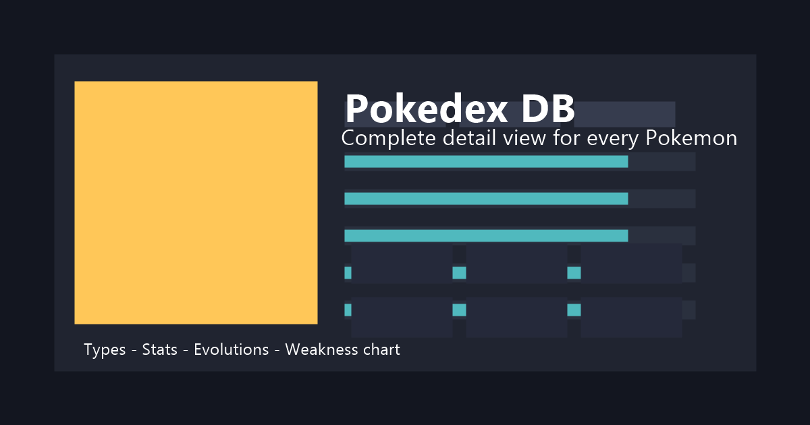

# PokedexDB

A fast, static Pokémon database built with React and Vite. Deployed to GitHub Pages with a custom domain.

[View the site](https://pokedexdb.com)



### Features
- **Browse Pokémon**: Clean card layout with sprites and key details
- **Filter & search**: Types, tags, games, items, moves, and more
- **Dedicated pages**: `Abilities`, `Items`, `Moves`, plus a small minigame
- **Zero backend**: Fully static build served from GitHub Pages

### Tech stack
- **React** 19 + **Vite** 7
- **ESLint** 9 for linting
- **GitHub Pages** deployment (`gh-pages`) with `CNAME` for `pokedexdb.com`

## Getting started

### Prerequisites
- Node.js 18+ (recommended)
- npm 9+ (or a compatible package manager)

### Install
```bash
npm install
```

### Develop
```bash
npm run dev
```
This starts Vite’s dev server with HMR.

### Build
```bash
npm run build
```
This runs `vite build` and then generates share pages and a sitemap via:
- `scripts/generate-share-pages.mjs`
- `scripts/generate-sitemap.mjs`

### Preview production build
```bash
npm run preview
```

### Lint
```bash
npm run lint
```

### Deploy
```bash
npm run deploy
```
Builds the site and publishes `dist/` to GitHub Pages via `gh-pages`. The `CNAME` file configures the custom domain `pokedexdb.com`.

## Project structure
```txt
.
├─ public/
│  ├─ data/
│  │  └─ pokemon_all.json
│  ├─ sprites/
│  │  └─ pokemon/              # ~6k sprite PNGs
│  └─ og-preview.png
├─ scripts/
│  ├─ generate-share-pages.mjs
│  └─ generate-sitemap.mjs
├─ src/
│  ├─ components/
│  │  ├─ PokemonCard.jsx
│  │  ├─ ErrorBoundary.jsx
│  │  └─ SpriteImage.jsx
│  ├─ sections/
│  │  ├─ FilterTabs.jsx
│  │  └─ GameFilters.jsx
│  ├─ constants/               # Game/type/species data maps
│  ├─ assets/                  # Logos and static assets
│  ├─ App.jsx
│  ├─ App.css
│  └─ main.jsx
├─ index.html
├─ vite.config.js
├─ eslint.config.js
└─ package.json
```

## Configuration
This project is a static site and does not require environment variables. If you introduce configuration, prefer Vite’s `VITE_*` env variables (`.env`, `.env.local`).

## Data & assets
- Primary dataset: `public/data/pokemon_all.json`
- Sprites: `public/sprites/pokemon/` (large asset set)
- Game logos and miscellaneous assets in `src/assets/` and `public/`

## Contributing
Issues and pull requests are welcome. Please:
- Keep changes focused and well-described
- Run `npm run lint` and ensure the app builds

## License
No license has been specified for this repository.

## Acknowledgements
Pokémon and all respective names/images are trademarks of their respective owners. This is a community project with no affiliation to Nintendo, Game Freak, or The Pokémon Company.
